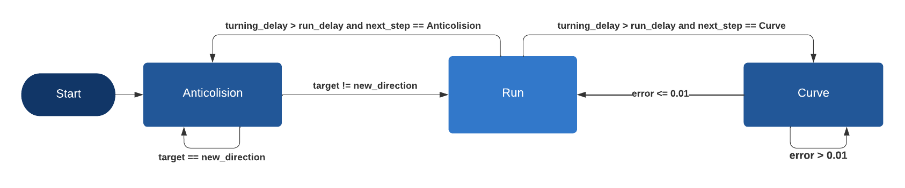

# Projeto Micromouse

Este projeto Micromouse é desenvolvido em Webots e inclui implementações de controle PID para orientação, navegação e resolução de labirintos do robô.

## Versões

### Versão 6.1.5.1

- Data: 15/11/2023

#### Mudanças

- Ajustes finos nos parâmetros do temporizador.
- Reorganização do código no maze_solution_algorithm.cpp.
- Atualização do diagrama de estados conforme .

### Versão 6.0.5.1

- Data: 12/11/2023

#### Mudanças

- Adição do algoritmo anticolisão (anti_colision.cpp) que utiliza apenas informações dos sensores ultrassônicos para manter o robô no centro do caminho.
- Integração do algoritmo anticolisão ao algoritmo geral (maze_solution_algorithm.cpp), representado por três estados conforme definido no diagrama de estados .
  - **Anticolisão:** Utiliza informações dos sensores ultrassônicos para manter o robô no centro do caminho. Parte do código também define a direção a ser virada.
  - **Pra Frente:** Parte do código sem controle que faz o robô avançar por um período de tempo determinado.
  - **Virar:** Implementação de PID que utiliza o giroscópio para girar o robô no próprio eixo.

### Versão 5.0.4.0

- Data: 30/10/2023

#### Mudanças

- Novo arquivo world (prototipo1) em que o robô e labirinto funcionam com os controladores disponíveis.
- Criação do .gitignore para que não sejam compartilhados arquivos .exe e da pasta build.

### Versão 4.0
- Data: 25/10/2023

#### Mudanças

- Integração dos algoritmos de orientação e navegação.
- Adaptação do robô para realizar curvas com base nas informações das paredes do labirinto.

### Versão 3.0
- Data: 25/10/2023

#### Mudanças

- Adição dos arquivos de execução do Webots.
- Importação do modelo CAD do Micromouse para o repositório.
- Implementação do algoritmo de navegação baseado na regra da mão esquerda.
- Separação dos algoritmos de orientação e navegação para melhor gerenciamento.

### Versão 2.0
- Data: 24/10/2023

#### Mudanças

- Adição de uma condição para permitir que o Micromouse realize curvas em torno de seu próprio eixo, ajustando os valores do controlador conforme o erro aumenta.

### Versão 1.1
- Data: 24/10/2023

#### Mudanças

- Adição da constante de PI para reduzir o erro na orientação do robô.

### Versão 1.0
- Data: 23/10/2023

#### Algoritmo de Orientação

Nesta versão, implementamos um algoritmo de orientação baseado em controle PID. O robô é capaz de girar para ângulos desejados de forma precisa, tornando-o apto para seguir direções de forma eficaz.

## Como Usar

Para utilizar este projeto, siga as etapas abaixo:

1. Clone o repositório do GitHub em seu ambiente de desenvolvimento.
2. Abra o projeto no Webots e execute o código fornecido no controlador do robô.
3. Observe o comportamento do robô ao seguir direções de forma eficaz com base no controle PID implementado.

## Autores

- Luan Alflen
- Lucas Keller
- Vinicius Carneiro
- Vitor Citelli
- Vitor Lenz
